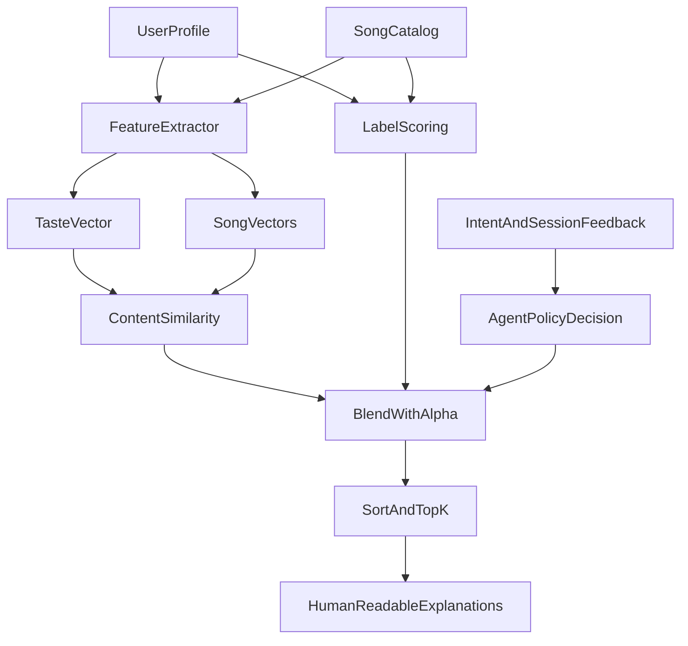

# EchoMind: Intent-Aware Music Recommender

## Title and Summary
EchoMind is a hybrid music recommendation system that ranks songs using both audio-feature similarity and explicit user preference matching. It matters because it demonstrates a core AI systems idea: combining interpretable rules with adaptive behavior can produce recommendations that are both understandable and useful. The project also shows how lightweight agentic policies can personalize rankings from intent and session feedback without requiring large-model retraining.

## Original Project (Modules 1-3) and Initial Scope
My original project from Modules 1-3 was the "Music Recommender Simulation". Its core goal was to recommend songs from a small catalog by matching each song against a user taste profile (genre, mood, target energy, and acoustic preference) using a transparent scoring rule. It could produce ranked top-k outputs with clear reasons, making it easy to inspect what the recommender got right or wrong.

## Architecture Overview
At a high level, EchoMind takes a user profile, computes two ranking signals for every song, and blends them into one final score:
- Content signal: cosine similarity in feature space (energy, tempo, valence, danceability, acousticness, etc.).
- Label signal: deterministic genre/mood/energy match score.
- Final ranking: `final = alpha * content + (1 - alpha) * label`, with optional policy adjustments.

The system diagram in `src/pipeline.py` maps directly to this flow:



In the current implementation:
- `src/pipeline.py` orchestrates scoring, policy application, guardrails, and top-k selection.
- `src/agent_policy.py` computes deterministic policy decisions from optional intent text and likes/skips.
- `src/app.py` exposes the flow in Streamlit and shows an agent reasoning trace.

## Setup Instructions
1. Clone and enter project folder
   ```bash
   git clone <your-repo-url>
   cd Applied-AI-System-Project
   ```

2. Create and activate a virtual environment (recommended)
   ```bash
   python3 -m venv .venv
   source .venv/bin/activate
   ```
   On Windows:
   ```bash
   .venv\Scripts\activate
   ```

3. Install dependencies
   ```bash
   pip install -r requirements.txt
   ```

4. Run the CLI demo
   ```bash
   python3 -m src.main
   ```

5. Run the Streamlit app
   ```bash
   streamlit run src/app.py
   ```

6. Run tests
   ```bash
   pytest
   ```

## Sample Interactions
The examples below come from actual CLI runs (`python3 -m src.main`) and show input profiles with resulting top recommendations.

### Example 1: Happy Pop Fan
   Input
- Genre: `pop`
- Mood: `happy`
- Target energy: `0.8`
- Likes acoustic: `False`

   Output (Top 3)
1. `Levitating` - score `0.848` (content `0.957`, label `0.740`)
2. `As It Was` - score `0.841` (content `0.967`, label `0.715`)
3. `Flowers` - score `0.840` (content `0.990`, label `0.690`)

### Example 2: Chill Lofi Listener
   Input
- Genre: `lofi`
- Mood: `chill`
- Target energy: `0.4`
- Likes acoustic: `True`

   Output (Top 3)
1. `Coffee` - score `0.969` (content `0.978`, label `0.960`)
2. `Aruarian Dance` - score `0.865` (content `0.989`, label `0.740`)
3. `Snowman` - score `0.829` (content `0.957`, label `0.700`)

### Example 3: High-Energy Rocker
   Input
- Genre: `rock`
- Mood: `intense`
- Target energy: `0.9`
- Likes acoustic: `False`

   Output (Top 3)
1. `Believer` - score `0.943` (content `0.946`, label `0.940`)
2. `Numb` - score `0.841` (content `0.957`, label `0.725`)
3. `Sicko Mode` - score `0.819` (content `0.973`, label `0.665`)

These outputs show that the system is functional and profile-sensitive: changing preferences shifts the top-ranked songs in meaningful ways.

## Design Decisions and Trade-offs
### Why I built it this way
- I used a hybrid ranker (content + label) to keep the model both adaptive and explainable.
- I integrated a deterministic agentic policy layer** so optional natural language intent and session feedback can influence ranking without making behavior opaque.
- I added guardrails and fallback paths so strict filters do not return empty recommendation lists.

### Trade-offs
- Interpretability vs complexity: deterministic logic is easier to debug than deep models, but less expressive than learned embeddings from real user logs.
- Small curated dataset vs realism: easier classroom experimentation, but limited coverage and diversity compared with production catalogs.
- Fast iteration vs long-term personalization: session likes/skips are lightweight and practical, but they do not capture long-term user history.

## Testing Summary
### What worked
- The CLI demo consistently produced ranked recommendations for contrasting user profiles.
- The blended signal behaved as expected: close feature matches and label matches both improved rank.
- The policy-integrated pipeline remained deterministic and traceable (including fallback and guardrail logic).

### What did not fully work or remains limited
- In this environment, `pytest` was not installed (`No module named pytest`), so I could not execute the automated tests during this specific run.
- Performance and ranking quality are constrained by the small `data/songs.csv` catalog.
- The policy is rule-based; it does not learn continuously from long-term behavior.

### What I learned from testing
- Even simple scoring systems can produce believable personalization when feature engineering is coherent.
- Explanations are essential: seeing `content_score` and `label_score` side-by-side made debugging much faster.
- Guardrails matter in recommendation systems because strict filters can otherwise reduce usefulness.

## Reflection
This project taught me that useful AI systems are not just about model sophistication; they are about making decisions observable, testable, and safe under edge cases. I learned how to decompose recommendation behavior into interpretable signals, then layer controlled adaptation on top with intent and session feedback. Most importantly, I saw that AI problem-solving is iterative: small, transparent design choices often produce stronger learning outcomes than jumping straight to black-box complexity.
